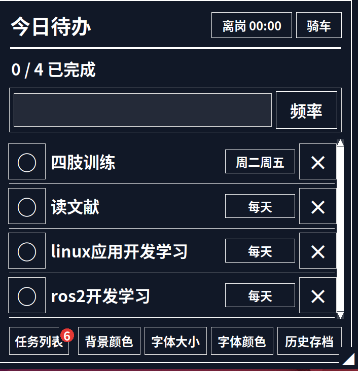
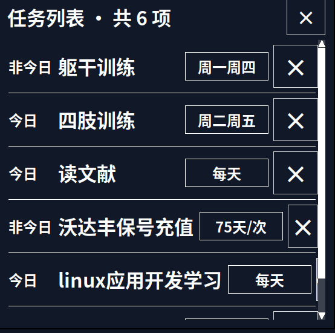
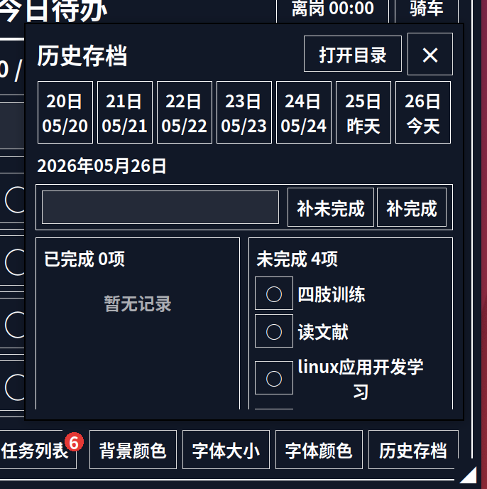
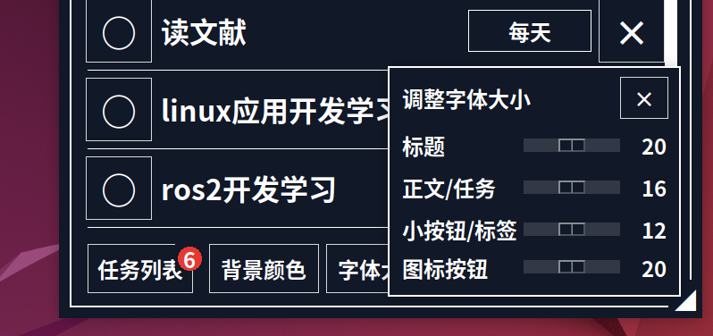
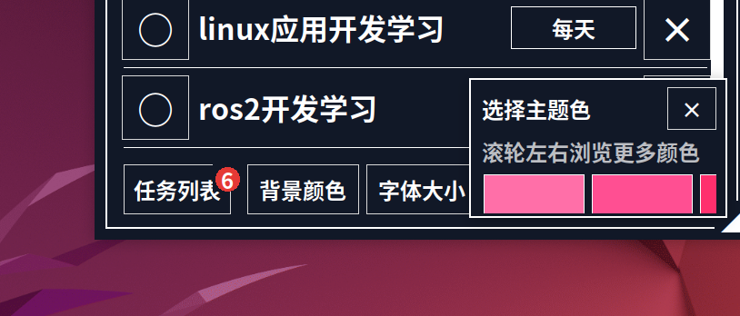

# 今日待办桌面小窗

一个面向 Linux 桌面的轻量待办小工具。程序常驻系统状态栏，点击小图标后在主显示器右上角弹出今日待办窗口；平时不占屏幕，需要时再打开。



## 主要功能

- 只显示今天该做的任务，减少干扰
- 支持单次、每天、工作日、自定义周期任务
- 自定义周期支持每周指定日期、每隔 N 天执行一次
- 支持任务列表统一管理所有任务
- 支持右键重命名任务、主窗口临时置顶任务
- 支持历史存档查看和补记
- 支持背景颜色、字体颜色、字体大小调整
- 支持到岗/离岗计时和通勤方式记录
- 每天零点自动归档完成和未完成事项
- 历史数据按年份、月份保存，方便交给 AI 做月度复盘

## 今日待办

主窗口只展示今天真正需要处理的任务。非今日任务不会出现在这里，但仍然可以在「任务列表」中管理。

窗口顶部包含：

- `到岗 / 离岗`：记录当天工作开始和结束，并累计工作时长
- `通勤`：记录今天是走路还是骑车

任务行包含：

- 左侧圆圈：切换完成状态
- 中间文字：任务名称
- 右侧频率：显示任务周期
- 最右侧 `×`：删除任务

主窗口支持右键菜单：

- `重命名`：修改任务名称，输入后点击窗口外自动保存
- `置顶`：将未完成任务临时排到最上方

置顶任务会有轻微高光。置顶是一次性的优先级标记：任务完成后会下沉到列表底部；如果再取消完成状态，会自动恢复为普通任务。

任务排序规则：

- 未完成置顶任务优先显示
- 未完成普通任务依次显示
- 已完成任务自动排到最下面

## 任务列表

「任务列表」会显示所有已创建任务，包括今天不需要出现的任务。每个任务会标记为「今日」或「非今日」，便于统一管理长期计划。



适合用来管理：

- 只在特定星期出现的训练计划
- 每天重复的学习任务
- 每隔 N 天出现一次的缴费、充值、维护类任务
- 未来才需要出现的待办事项

任务列表右键只提供 `重命名`，用于统一管理任务名称，不提供置顶操作。

## 历史存档

「历史存档」用于查看和修改最近 7 天的归档记录。点击日期按钮可以切换到对应日期，查看当天已完成和未完成的事情。



历史窗口支持：

- 查看过去 7 天记录
- 将任务在「已完成」和「未完成」之间移动
- 手动补记完成事项
- 手动补记未完成事项
- 打开当前月份的历史数据目录

这适合补记临时发生但忘记打卡的事情，比如锻炼、外出、学习、维护设备等。

## 频率设置

创建任务时先输入任务名称，再点击「频率」选择任务出现规则。

支持：

- `单次`：只出现一次，第二天自动清除
- `每天`：每天出现，第二天重置为未完成
- `工作日`：周一到周五出现
- `自定义`：可选择每周指定日期，或设置每隔多少天执行一次

对于「每隔 N 天」的任务，在任务列表中点击频率按钮，可以在 `75天/次` 和 `剩余天数` 之间切换查看。

## 主题颜色

可以通过「背景颜色」调整窗口背景。颜色面板支持横向滚动查看更多颜色。


## 字体大小

可以通过「字体大小」调整不同区域的字体尺寸。



可调整项包括：

- 标题
- 正文/任务
- 小按钮/标签
- 图标按钮

字体大小使用像素值保存，避免系统 DPI 或开机自启动时缩放不稳定导致字体忽大忽小。

## 字体颜色

可以通过「字体颜色」调整主题文字和强调色。



## 到岗计时与通勤记录

主窗口右上角的 `到岗 / 离岗` 按钮用于记录当天工作时长。

- 点击 `到岗`：开始计时
- 点击 `离岗`：结束当前工作时段
- 一天内可以多次到岗/离岗
- 每天零点归档时，会记录当天总工作时长

`通勤` 按钮用于记录当天通勤方式：

- 走路
- 骑车

这个功能适合提醒自己今天是不是骑车来的，避免下班走路回家后第二天找不到车。

## 历史数据格式

历史记录按年份和月份保存：

```text
history/
  2026/
    2026-05/
      daily_records.sqlite3
      daily_records.jsonl
      README.txt
```

每个月目录中包含：

- `daily_records.sqlite3`：SQLite3 数据库
- `daily_records.jsonl`：JSON Lines 文本文件，适合直接交给 AI 分析
- `README.txt`：字段说明

历史记录包含：

- 日期
- 已完成任务列表
- 未完成任务列表
- 完成数量
- 未完成数量
- 写入时间
- 当天附加状态，例如到岗/离岗时间、工作时长、通勤方式

## 运行

```bash
./launch.sh
```

或者：

```bash
python3 desktop_todo.py
```

## 依赖

- Python 3
- Tkinter
- PyGObject / GTK 3
- X11 桌面环境

Ubuntu 上如果缺少依赖，可以尝试：

```bash
sudo apt install python3-tk python3-gi gir1.2-gtk-3.0
```

## 数据文件

这些文件是本机个人数据，默认不会提交到 Git：

- `tasks.json`：当前任务
- `settings.json`：主题、字体、日期状态等设置
- `daily_status.json`：到岗/离岗、通勤方式等每日状态
- `history/`：每日历史归档
- `daily_history.sqlite3`、`daily_history.jsonl`：旧版历史文件

## 开机自启动

可以创建一个本机 `.desktop` 文件放到：

```bash
~/.config/autostart/
```

其中 `Exec` 指向本项目里的 `launch.sh`，`Icon` 指向 `assets/tray_icon.png`。

## 截图文件

README 中引用的截图放在：

```text
assets/screenshots/
```

建议文件名：

- `main-window.png`
- `task-list.png`
- `history-archive.png`
- `background-color.png`
- `font-size.png`
- `font-color.png`
